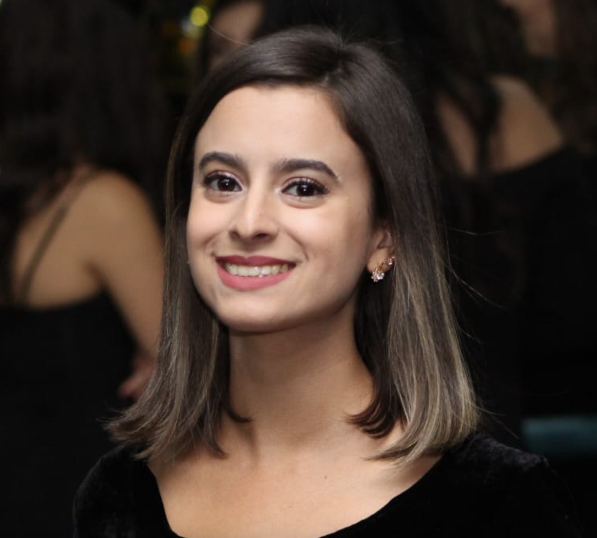

<picture>
     <source media="(prefers-color-scheme: dark)" srcset="YOUR-DARKMODE-IMAGE">
     <source media="(prefers-color-scheme: light)" srcset="YOUR-LIGHTMODE-IMAGE">
     
</picture>

# Hi, there! 🙋🏻‍♀️
I am an aspiring Software Engineer who just finished a Software Engineering Skills Bootcamp at HyperionDev 👩🏻‍💻, supported by the Department for Education.
I enjoy solving problems by creating solution using Python, and always looking forward to improve my skills 🚀!
 - 🖥️ Tech stack: Python, HTML, CSS, Django and Bootstrap.
 - 🔭 Passionate about science and everything fact-based.
 - 🔮 Looking for a junior software developer job opportunity.

---

✉️ Reach me at [ LinkedIn](https://www.linkedin.com/in/júlia-barbosa-b3457941/)